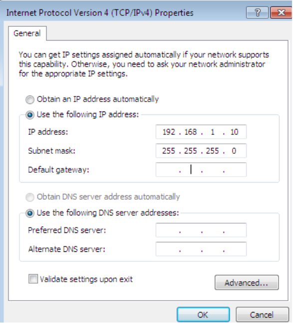
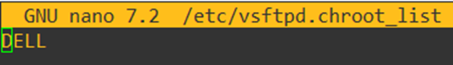
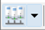
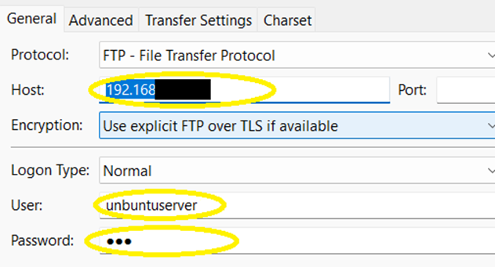
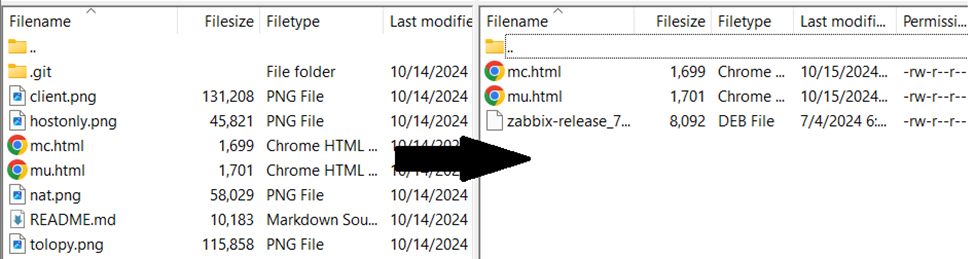

# Cấu hình Loadbalancing bằng NGINX trên Ubuntus Server
## Nội dung
- **I. Cài đặt gói BIND và NGINX**
- **II. Cấu hình ip tĩnh**
    - **1. Cấu hình IP tĩnh trên Loadbalancer**
    - **2. Cấu hình IP tĩnh trên các node**
    - **3. Cấu hình IP tĩnh trên Client**
- **III. Cấu hình DNS trên Server Loadbalancer**
    - **1. Cấu hình BIND**
    - **2. Khai báo zone**
    - **3. Tạo file record của các zone**
    - **4. Khởi động dịch vụ DNS**
- **III. Cấu hình NGINX**
    - **1. Cấu hình Loadbalancer Server**
    - **2. Cấu hình trên các node**
    - **3. Khởi động lại dịch vụ NGINX**
- **IV. Truyền file lên các Nodes bằng FileZilla**
    - **1. Cài đặt Vsftpd**
    - **2. Cấu hình Vsftpd**
    - **3. Truyền tải file từ máy thật sang server node**

## I. Cài đặt BIND và NGINX
### 1. Chuẩn bị 
- Hãy đảm bảo máy ảo có kết nối mạng đến bên ngoài.

### 2. Tiến hành cài gói BIND
- Tiến hành cài gói BIND
- ```sudo apt update```
- ```sudo apt install bind9 bind9utils bind9-doc```
- ```sudo nano /etc/default/named```
- Thêm -4 vào ```OPTIONS="-u bind -4"``` nhằm đảm bảo rằng nó chỉ sử dụng IPv4, giúp tránh các vấn đề tiềm ẩn liên quan đến Ipv6.
### 3. Tiến hành cài đạt gói NGINX
- ```sudo apt-get update```
- ```apt-get install nginx```
- ```nginx -v``` kiểm tra version nginx
- ```sudo ufw allow 80``` cho phép port 80 http của nginx vượt tường lửa
- Làm tương tự trên 2 node
## II. Cấu hình IP tĩnh

```
Server dựng Load Balancer: 192.168.1.1/24 (Ubuntuserver)
Node 1: 192.168.1.2/24 (Ubuntuserver)
Node 2: 192.168.1.3/24 (Ubuntuserver)
Client 1: 192.168.1.10/24 (Windows 7)
Client 2: 192.168.1.20/24 (Windows 7 nếu có)
```

### 1. Cấu hình IP tĩnh trên Loadbalancer
- Ở /etc/netplan/50-cloud-init.yaml tiến hành cấu hình, chuyển dhcp4 thành no và sử dụng địa chỉ ip tĩnh như sau:
```sh
network:
  version: 2
  renderer: networkd
  ethernets:
    ens33:
      dhcp4: no
      addresses:
        - 192.168.1.1/24 #địa chỉ của server loadbalancer
      routes:
        - to: default
          via: 192.168.1.1
      nameservers:
        addresses:
          - 192.168.1.1 #ip của server dns
        search: [sgu.edu.vn]
#ví dụ ns1.sgu.edu.vn nhưng chỉ gõ ns1 thì sẽ tự động điền thêm phần sgu.edu.vn
```
- ```sudo netplan apply``` để áp dụng những cấu hình trên.
### 2. Cấu hình IP tĩnh trên node
Ta thực hiện cấu hình file 50-cloud-init.yaml như trên:
```sh
network:
  version: 2
  renderer: networkd
  ethernets:
    ens33:
      dhcp4: no
      addresses:
        - 192.168.1.2/24 #địa chỉ của node thứ nhất
        #- 192.168.1.3/24 #địa chỉ của node thứ hai
      routes:
        - to: default
          via: 192.168.1.1
```
- ```sudo netplan apply``` để áp dụng những cấu hình trên.
### 3. Cấu hình IP tĩnh trên Client

## III. Cấu hình DNS trên Server Loadbalancer
### 1. Cấu hình BIND
- ```sudo nano /etc/bind/named.conf.options```
- Thực hiện chỉnh sửa như sau:
```sh
options {
        directory "/var/cache/bind";
        listen-on port 53 { 192.168.1.1; };# trỏ đến địa chỉ server
        allow-query { localhost; 192.168.1.0/24 ;any; };#cho phép lớp mạng này  truy vấn DNS 
        recursion yes;
        allow-transfer {none; };
        forwarders {};
        dnssec-validation no ;
        #listen-on-v6 { any; }; comment đi để ko sử dụng ipv6
};
```
### 2. Khai báo zone
- ```sudo nano /etc/bind/named.conf.local```
```sh
zone "sgu.edu.vn" {
        type primary; #phân giải thuận
        file "/etc/bind/zones/db.sgu.edu.vn";
        allow-transfer {};
};
zone "1.168.192.in-addr.arpa" {
        type primary; #phân giải ngược
        file "/etc/bind/zones/db.1.168.192";
        allow-transfer {};
};
```
### 3. Tạo file record của các zone
-  ```sudo mkdir /etc/bind/zones``` tạo folder zones
- ```sudo cp  /etc/bind/db.local  /etc/bind/zones/db.sgu.edu.vn``` copy file cấu hình mẫu
- ```sudo nano /etc/bind/zones/db.sgu.edu.vn```	 tiến hành cấu hình vùng phân giải thuận
```sh
; BIND data file for local loopback interface
;
$TTL    604800
@       IN      SOA     ns1.sgu.edu.vn. root.sgu.edu.vn. (
                              2         ; Serial
                         604800         ; Refresh
                          86400         ; Retry
                        2419200         ; Expire
                         604800 )       ; Negative Cache TTL
;
@       IN      NS      ns1.sgu.edu.vn.
@       IN      A       192.168.1.1
ns1     IN      A       192.168.1.1
```
- ```sudo cp /etc/bind/db.127 /etc/bind/zones/db.1.168.192```	copy file cấu hình mẫu
- *Chú ý: nếu không thực hiện được câu lệnh trên thì:
- ```sudo touch  /etc/bind/zones/db.1.168.192```
Sau đó ```nano /etc/bind/db.127``` ctrl +A copy sang ```nano /etc/bind/zones/db.1.168.192``` paste vào.( Có thể dùng putty để telnet đến để paste)

- ```sudo nano /etc/bind/zones/db.1.168.192```	tiến hành cấu hình vùng phân giải ngược
```sh
$TTL    604800
@       IN      SOA     ns1.sgu.edu.vn. root.sgu.edu.vn. (
                              1         ; Serial
                         604800         ; Refresh
                          86400         ; Retry
                        2419200         ; Expire
                         604800 )       ; Negative Cache TTL
;
@       IN      NS      ns1.sgu.edu.vn.
1       IN      PTR     ns1.sgu.edu.vn.
1       IN      PTR     sgu.edu.vn
```
### 4. Khởi động dịch vụ DNS
- Sau khi hoàn thành các bước trên tiến hành test thử:
- ```sudo named-checkconf```
- ```sudo named-checkzone sgu.edu.vn  /etc/bind/zones/db.sgu.edu.vn```
- ```sudo named-checkzone 1.168.192.in-addr.arpa  /etc/bind/zones/db.1.168.192```
- Nếu không có lỗi ta tiến hành khởi động Bind:
- ```sudo systemctl restart bind9```
- ```sudo ufw allow Bind9``` (cho phép allow bind nếu có dùng tường lửa)
- Đến đây ta đã cấu hình được DNS với tên miền là sgu.edu.vn , ip là 192.168.1.1/24
## III. Cấu hình NGINX
### 1. Cấu hình Loadbalancer Server
#### Trên server Load Balancer ta tiến hành cấu hình:
- ```Sudo nano /etc/nginx/sites-available/default```
- Thêm block upstream có tên là backend
```sh
upstream backend {
        server 192.168.1.2; #đây là ip của node thứ nhất để chịu tải
        server 192.168.1.3; #đây là ip của node thứ hai để chịu tải
}
```
- Chỉnh phần ip của server_name về ip của server Load Balancer đang cấu hình
- ```server_name 192.168.1.1;```
- Trong location ta thêm dòng proxy_pass để upstream đã khai báo ở trên
```sh
location / {
                # First attempt to serve request as file, then
                # as directory, then fall back to displaying a 404.
                try_files $uri $uri/ =404;
                proxy_pass http://backend;
        }
```
- Restart lại 	```sudo systemctl restart nginx```
- Kiểm tra lỗi cấu hình nếu có	```nginx -t```
#### Tiếp đến ta cấu hình web ở trên 2 node
- ```/etc/nginx/sites-available/``` :Thư mục chứa các file cấu hình server block.
- ```/etc/nginx/sites-enabled/``` :Thư mục chứa Danh sách các server blocks được kích hoạt, thường là kích hoạt từ sites-available
- Tiến hành truy cập vào sites-availables ```cd /etc/nginx/sites-availables```
-Tạo mới file dùng để cấu hình web ```sudo touch server1.local```
-Cấu hình ```sudo nano server1.local```	cấu hình như sau:
``` sh
server {
    listen 80;
    root  /var/www/project; #folder chứa file html,css,php,.. của web
    index   index.html; #trỏ đến file index để hiển thị
    server_name sgu.edu.vn;
    location / {
        try_files $uri $uri/ =404;
#thử đường dẫn bằng biến uri là URL người dùng truy cập, nếu không có tệp nào tương ứng với uri #hoặc trong thử mục uri cũng không có nốt, nó sẽ báo lỗi 404 not found
    }
}
```
- Làm tương tự trên node với file là ```server2.local```.
- Kế tiếp ta sẽ tạo 1 symbolic link server2.local từ sites-availables liên kết đến sites-enabled.Nginx sẽ đọc các file cấu hình tại thư mục sites-enabled mỗi khi khởi động:
- ```sudo ln -s /etc/nginx/sites-available/server2.local /etc/nginx/sites-enabled/```
- ```sudo nginx –t```
- ```sudo systemctl restart nginx```
- Cuối cùng ta sẽ truy cập đến đường dẫn đã trỏ lúc này để bắt đầu phát triển web
- ```cd /var/www/project```
- Tiến hành tạo file index.html
- ```sudo touch index.html```
- Sau đó có thể code web theo ý thích chẳng hạn ở đây nhóm mình có 1 đoạn code nhỏ cho mọi người demo, các bạn có thể copy và paste vào file index.html này.
[Mở file HTML mu.html](./mu.html)
[Mở file HTML mc.html](./mc.html)

- Sau khi thực hiện xong ta reset và bật nginx để hoạt động:
```
systemctl status nginx
sudo systemctl start nginx
sudo systemctl stop nginx
sudo systemctl enable nginx
```
## IV. Truyền file lên các Nodes bằng FileZilla
### 1. Cài đặt Vsftpd
- Để cài đặt Vsftpd ta phải có kết nối ra ngoài internet, vì vậy phải đảm bảo card mạng là card NAT.

- Tiếp theo ta cấu hình để bật dhcp tắt ip tĩnh bằng cách 
- ```sudo -i``` chuyển hẳn sang quyền root.
- ```nano /etc/netplan/50-cloud-init.yaml```
- Tiến hành chuyến dhcp4 thành yes và comment đi các cấu hình ip tĩnh.
``` sh
network:
  version: 2
  renderer: networkd
  ethernets:
    ens33:
      dhcp4: yes
      #addresses:
       # - 192.168.1.3/24
      #routes:
        #- to: default
          #via: 192.168.1.1
```
- ``` netplan apply``` để áp dụng cấu hình trên.
- ``` apt install vsftpd`` để cài đặt vsftpd.
### 2. Cấu hình Vsftpd
- Khởi động Vsftpd 
- ```Sudo systemctl start vsftpd```
- ```Sudo systemctl enable vsftpd```
- Tiến hành cấu hình:
-```Sudo nano /etc/vsftpd.conf```
- Chuyển 2 option như sau để cho phép truyền file và không sử dụng trên ipv6.
``` sh
listen=YES 
listen_ipv6=NO
```
- Ở đây mình không cấu hình cho anonymous nên mình sẽ cấu hình chroot_list. Ta tiến hành uncomment, nếu đã uncomment rồi thì hãy bỏ qua.
``` sh
  local_enable=YES
  write_enable=YES
  local_umask=022
  dirmessage_enable=YES
  use_localtime=YES
  xferlog_enable=YES
  connect_from_port_20=YES
  chroot_local_user=YES
  chroot_list_enable=YES
  chroot_list_file=/etc/vsftpd.chroot_list # đường dẫn file liệt kê các user có thể dùng FTP
  secure_chroot_dir=/var/run/vsftpd/empty
  pam_service_name=vsftpd
  rsa_cert_file=/etc/ssl/certs/ssl-cert-snakeoil.pem
  rsa_private_key_file=/etc/ssl/private/ssl-cert-snakeoil.key
  ssl_enable=NO
  allow_writeable_chroot=YES 
```
- Ở đâu chúng ta thêm dòng ```allow_writeable_chroot=YES``` nhằm để tránh lỗi ```refusing to run with writable root inside chroot()```. Việc này nhằm cho phép người dùng vẫn có thể ghi vào thư mục gốc (thư mục home của từng người dùng trong chroot_list), mỗi người dùng sẽ có mỗi folder home khác nhau và file tải lên sẽ được ghi vào đó.

- Sau đó ta tiến hành cấu hình ```/etc/vsftpd.chroot_list``` bằng cách thêm các tên user dùng để truyền file lên server , ở đây trong lab này mình sẽ thêm tên của PC thật mình đang dùng vào, mọi người có thể kiểm tra bằng cách vào cmd như mình ví dụ:

- Ở đây tên user của mình là DELL nên mình sẽ thêm vào /etc/vsftpd.chroot_list.


### 3. Truyền tải file từ máy thật sang node server
- Xong các bước trên ta tiến hành ```systemctl restart vsftpd``` và thực hiện truyền file lên server.
- Vào filezilla ấn vào dưới đây để thêm host mới.


- Ta điền ip của server, tên và mật khẩu đăng nhập server vào, port có thể bỏ trống vì mặc định  là 20 hoặc 21 rồi. Sau đó ta ấn Connect.
- Sau đó ta tiến hành kéo từ trái sang phải theo hướng mũi tên. Vậy là đã hoàn thành việc truyền tải file bằng Filezilla thông qua FTP rồi. Các folder sau khi được truyền sẽ nằm ở thư mục home/tên người dùng. Như ví dụ của mình thì server mình tên unbuntuserver thì các file vừa tải mc.html và mu.html sẽ nằm ở /home/unbuntuserver.



- Sau khi cài xong ta tiến hành chuyển tất cả card mạng của Server, Node và Client sang VMnet1 (host only)
- Tiến hành cấu hình ip tĩnh ```sudo nano /etc/netplan/50-cloud-init.yaml``` chuyển dchp4 thành NO và uncomment các cấu hình ip tĩnh, cuối cùng là ```sudo netplan apply```
``` sh
network:
  version: 2
  renderer: networkd
  ethernets:
    ens33:
      dhcp4: NO
      addresses:
        - 192.168.1.3/24
      routes:
        - to: default
          via: 192.168.1.1
```

- Trên client ta có thể dùng trình duyệt web để truy cập đến sgu.edu.vn, mỗi lần request, server sẽ điều hướng đến 1 node khác nhau và thể hiện một giao diện web khác nhau.
- Đến đây là đã kết thúc phần tài liệu tham khảo về Load Balancing sử dụng NGINX trên Ubuntu server của nhóm chúng em, cảm ơn mọi người đã quan tâm
