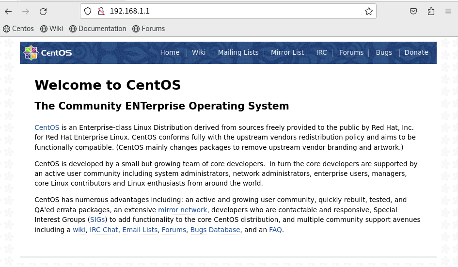

# Cấu hình Loadbalancing bằng NGINX trên CentOS
 Video tham khảo https://www.youtube.com/watch?v=fdOh9TxkmKY
## Nội dung
- **I. Cài đặt gói BIND và NGINX**
- **II. Cấu hình ip tĩnh**
    - **1. Cấu hình IP tĩnh trên Loadbalancer**
    - **2. Cấu hình IP tĩnh trên các Node**
    - **3. Cấu hình IP tĩnh trên Client**
- **III. Cấu hình DNS trên Server Loadbalancer**
    - **1. Cấu hình BIND**
    - **2. Khai báo zone**
    - **3. Tạo file record của các zone**
    - **4. Khởi động dịch vụ DNS**
- **III. Cấu hình NGINX**
    - **1. Cấu hình Loadbalancer Server**
    - **2. Cấu hình trên các node**

## I. Cài đặt BIND và NGINX
### 1. Chuẩn bị 
- Hãy đảm bảo máy ảo có kết nối mạng đến bên ngoài.

### 2. Tiến hành cài gói BIND
- Tiến hành cài gói BIND như sau:
- ```sudo yum update -y```
- ```yum install bind -y```, để kiểm tra cài đặt thành công ta gõ ```rpm -qa| grep bind``` (hoặc kiểm tra phiên bản đã cài ```nginx -v```).
- Chỉ cần cài đặt trên Load blancer server thôi, không cần cài trên 2 node.
### 3. Tiến hành cài đạt gói NGINX
- Nginx không có sẵn trong kho lưu trữ mặc định của CentOS, vì vậy bạn cần thêm kho EPEL (Extra Packages for Enterprise Linux)
- ```sudo yum install epel-release``` tiếp theo ta cài đặt nginx ```sudo yum install nginx -y```, kiểm tra việc cài đặt bằng  ```rpm -qa| grep nginx```
- Ta tiến hành tắt tường lửa đi để dễ dàng cho việc demo:
```
systemctl stop firewalld
systemctl disable firewalld
```
- Làm tương tự trên 2 node. (trên các node có thể dựng web server bằng Apache hoặc NGINX, ở hướng dẫn này sử dụng NGINX)
## II. Cấu hình IP tĩnh
```
Server Load Balancer: 192.168.1.1/24
Node 1: 192.168.1.2/24
Node 2: 192.168.1.3/24
Client 1: 192.168.1.10/24
Client 2: 192.168.1.20/24 (không bắt buộc)
```

### 1. Cấu hình IP tĩnh trên Loadbalancer
- Ở dây ta nên tiến hành chuyển card mạng sang host only:
  

- Sau đó ta cấu hình IP tĩnh như hình dưới:
  


- Sau khi cấu hình xong ta có thể khởi động NGINX và truy cập vào 192.168.1.1 bằng firefox,chorme,... để có thể thấy nginx hoạt động như dưới:
- ```
    sudo systemctl start nginx
    sudo systemctl enable nginx
    sudo systemctl status nginx
  ```

### 2. Cấu hình IP tĩnh trên node
- Ở node thứ nhất và thứ 2 ta cấu hình như trên:
### 3. Cấu hình IP tĩnh trên Client
- Chuyển địa chỉ ip của client sang như sau.
  

## III. Cấu hình DNS trên Server Loadbalancer
### 1. Cấu hình BIND
- ```sudo nano /etc/named.conf```
- Thực hiện chỉnh sửa như sau:
```sh
options {
	listen-on port 53 { 127.0.0.1; 192.168.1.1;}; // thêm địa chỉ của server
	//listen-on-v6 port 53 { ::1; }; comment đi để không sử dụng ipv6
	allow-query     { localhost; 192.168.1.0/24;}; // thêm lớp mạng của server vào
    ...
};
```
### 2. Khai báo zone
- ```sudo nano /etc/named.rfc1912.zones```
- Ta tiến hành thêm zone sgu.edu.vn như sau:
```sh
zone "sgu.edu.vn" IN {
  type master;
  file "sgu.edu.vn.zone";
  allow-update { none; };
};
zone "1.168.192.in-addr.arpa" IN {
  type master;
  file "reverse.192.168.1.0";
  allow-update { none; };
};
```
### 3. Tạo file record của các zone
- ```sudo nano /var/named/sgu.edu.vn.zone``` tiến hành cấu hình vùng phân giải thuận
```sh
$ORIGIN sgu.edu.vn.
$TTL 1d
@    IN    SOA    ns1.sgu.edu.vn. root.sgu.edu.vn. (
        2024091801  ; Serial
        1w          ; Refresh
        2h          ; Retry
        4w          ; Expire
        1d          ; Minimum TTL
)
@    IN  NS    ns1.sgu.edu.vn.
@    IN  NS    ns2.sgu.edu.vn.
@    IN  NS    ns3.sgu.edu.vn.
@    IN  A     192.168.1.1
ns1  IN  A     192.168.1.1
ns2  IN  A     192.168.1.2
ns3  IN  A     192.168.1.3
```
- ```sudo nano /var/named/reverse.192.168.1.0 ``` tiến hành cấu hình vùng phân giải ngược
```sh
$TTL 1d
@    IN    SOA    ns1.sgu.edu.vn. root.sgu.edu.vn. (
        2024091801  ; Serial
        1w          ; Refresh
        2h          ; Retry
        4w          ; Expire
        1d          ; Minimum TTL
)
@    IN  NS    ns1.sgu.edu.vn.
@    IN  NS    ns2.sgu.edu.vn.
@    IN  NS    ns3.sgu.edu.vn.
1    IN  PTR   sgu.edu.vn.
1    IN  PTR   ns1.sgu.edu.vn
2    IN  PTR   ns2.sgu.edu.vn 
3    IN  PTR   ns3.sgu.edu.vn 
```
### 4. Khởi động dịch vụ DNS
- Ta tiến hành khởi động named:
- ```systemctl enable named```
- ```systemctl start named```
- ```systemctl restart named```
- Đến đây ta đã cấu hình được DNS với tên miền là sgu.edu.vn , ip là 192.168.1.1/24
- Mẹo: Nếu ta bị lỗi lúc ```systemctl restart named``` ta có thể thử ```sudo lsof -i :53``` và ```kill -9 PID``` những process đang dùng port 53 (TCP/UDP) rồi thử lại.
  
## III. Cấu hình NGINX
- Một số folder đáng lưu ý:
	- ```/usr/share/nginx/html``` : thư mục chứa nội dung mã nguồn website.
	- ```/etc/nginx/``` : Thư mục chứa các file cấu hình của Nginx.
	- ```/etc/nginx/nginx.conf``` : File mà nginx sẽ load lên đầu tiên, tuy nhiên ta không cấu hình ở đây mà sẽ cấu hình ở 1 file được tạo mới có đuôi .conf được chứa.
  	- ```/etc/nginx/nginx.conf.default``` :File mà nginx sẽ load server block mặc định nếu không có server block nào khớp với tên miền mà user request.
  	- ```/etc/nginx/conf.d``` : Thư mục chứa các file cấu hình block server, mỗi block sẽ ứng với 1 tên miền, các file ở đây phải được tạo với đuôi .conf để nginx có thể nhận dạng và load.
	- ```/etc/nginx/default.d``` : Thư mục chứa các file cấu hình block server mặc định khi không có server block nào khớp với tên miền mà user request.
  
### 1. Cấu hình Loadbalancer Server
- Có thể cấu hình luôn ở trong file ```/etc/nginx/nginx.conf```. Nhưng nếu quản lý nhiều domain, có thể gây khó khăn trong việc quản lý. Vì vậy ta nên chia nhỏ các file ra để cấu hình.
- Ở /etc/nginx/nginx.conf ta chú ý có dòng  ```include /etc/nginx/conf.d/*.conf;``` nghĩa là nginx sẽ load các server block của các file được định dạng .conf trong đường đẫn đó lên để hiển thị khi người dùng request.
- Tiến hành tạo block cho server sgu.edu.vn ```touch /etc/nginx/conf.d/sgu.edu.vn.conf```, sau đó cấu hình như sau :
```sh
upstream backend {
	#least_conn;
	#slow_start;
	#ip_hash;
	#server ns2.sgu.edu.vn weight=3;
	#server ns3.sgu.edu.vn weight=1 ;
	server ns2.sgu.edu.vn; #đây node thứ nhất để chịu tải .Mặc định thuật toán điều hướng sẽ là Round Robin
	server ns3.sgu.edu.vn; #đây node thứ hai để chịu tải
}

server {
	listen       80;
	server_name  sgu.edu.vn ns1.sgu.edu.vn;

	location / {	#thêm block location để trỏ đến upstream ở trên chứa 2 node
		proxy_pass http://backend;
	}
}
```
## Giải thích về cách tham số và thuật toán:
- ```weight``` :thông số càng lớn , Round Robin điều hướng về server đó càng nhiều, ví dụ server1 weight=3, server2 weight=1 , khi có 4 request, 3 request sẽ được điều hướng về server 1, 1 request sẽ được đưa về server2 .Tuy nhiên trước khi weight được áp dụng nginx sẽ thực hiện vòng phân phối đầu tiên theo cách cơ bản của round-robin (1 lần đến mỗi server) để đảm bảo rằng tất cả các server trong nhóm backend đã sẵn sàng và hoạt động bình thường.
- ```ip_hash```: Nginx lấy ip của client đến một backend server cụ thể, đảm bảo rằng các yêu cầu từ cùng một client luôn được xử lý bởi cùng một server.
- ```least_conn``` : server có ít kết nối nhất thì được điều hướng đến
- ```slow_start``` :VD trong 30s thì nó không đổ dồn 100 ngườingười request và mà nó sẽ tăng chầm chậm dần lên từ 0->1->2.. rồi sao cho trong 30s đó nó sẽ trở về với khả nằng đáp ứng request ban đầu là 100 chẳng hạn.
- ```down``` : đánh dấu server đó không hoạt động.
 
- Kiểm tra lại cấu hình bằng ```nginx -t```
- Restart lại 	```sudo systemctl restart nginx```
- Nếu có lỗi ta tiến hành ```journalctl -xe nginx``` để tìm lỗi nếu là lỗi chính tả. Nếu không có lỗi chính tả ta tiến hành ```sudo lsof -i :80``` để kiểm tra các tiến trình đang dùng chung port 80 với Nginx, nếu có hãy kết thúc bằng câu lệnh ```kill -9 PID``` với PID là ID của tiến trình đang dùng port 80 đã nói trên. Sau đó tiến hành restart lại Nginx.

### 2. Cấu hình trên các node
- Tiến hành tạo block cho serve sgu.edu.vn trên node thứ nhất```touch /etc/nginx/conf.d/sgu.edu.vn.conf```, sau đó cấu hình trên Node thứ nhất như sau :
``` sh
server {
	listen       80;
	server_name  ns2.sgu.edu.vn;
	root         /usr/share/nginx/html;
	index	index.html; # thêm dòng này để chỉ đến file index
}
```

- Làm tương tự trên node thứ 2 và cấu hình như sau:
```sh
server {
	listen       80;
	server_name  ns3.sgu.edu.vn;
	root         /usr/share/nginx/html;
	index	index.html;
}
```

- ```sudo nginx –t```
- ```sudo systemctl restart nginx```
- Cuối cùng ta sẽ truy cập đến đường dẫn đã trỏ lúc này để bắt đầu phát triển web
- ```cd /usr/share/nginx/html```
- Tiến hành phát triển file index.html
- ```sudo gedit index.html```
- Sau đó có thể code web theo ý thích chẳng hạn ở đây nhóm mình có 1 đoạn code nhỏ cho mọi người demo, các bạn có thể copy và paste vào file index.html này.
 [File cho node thứ nhất](./index1.html)
[File cho node thứ hai](./index2.html)
- Để sử dụng Web nhóm cung cấp, hãy lưu tất cả các ảnh trong folder [Ảnh Demo Web](https://github.com/tanduong9424/Load-Balancing-NGINX/tree/main/img) vào /usr/share/nginx/html/img để hoạt động
- Sau khi thực hiện xong ta restart NGINX để hoạt động:
```
sudo nginx -t
sudo systemctl restart nginx
```

- Trên client ta có thể dùng trình duyệt web để truy cập đến sgu.edu.vn, mỗi lần request, server sẽ điều hướng đến 1 node khác nhau và thể hiện một giao diện web khác nhau.
- Đến đây là đã kết thúc phần tài liệu tham khảo về Load Balancing sử dụng NGINX trên CentOS của nhóm chúng em, cảm ơn mọi người đã quan tâm.
